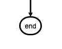
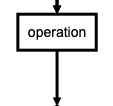
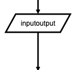
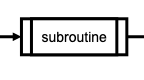
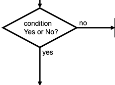
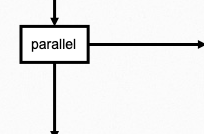

[](http://js.org)

# flowchart.js

## Example

[example](https://github.com/adrai/flowchart.js/blob/master/example/index.html)

## Requirements
You will need [Raphaël](http://www.raphaeljs.com/)

## CDN
flowchart.js is on [CDNJS](https://cdnjs.com/libraries/flowchart), feel free to use it

## Usage

On your page you need to include Raphaël like so:

```html
<script src="raphael-min.js"></script>
```

or

```node.js
npm install flowchart.js
```

and then

```html
<div id="diagram">Diagram will be placed here</div>
<script src="flowchart.js"></script>
<script>
  var diagram = flowchart.parse('st=>start: Start:>http://www.google.com[blank]\n' +
                                'e=>end:>http://www.google.com\n' +
                                'op1=>operation: My Operation:$myFunction\n' +
                                'op2=>operation: Stuff|current\n' +
                                'sub1=>subroutine: My Subroutine\n' +
                                'cond=>condition: Yes \n' + // use cond(align-next=no) to disable vertical align of symbols below
                                'or No?\n:>http://www.google.com\n' +
                                'c2=>condition: Good idea|rejected\n' +
                                'io=>inputoutput: catch something...|request\n' +
                                '\n' +
                                'st->op1(right)->cond\n' +
                                'cond(yes, right)->c2\n' + // conditions can also be redirected like cond(yes, bottom) or cond(yes, right)
                                'cond(no)->sub1(left)->op1\n' + // the other symbols too...
                                'c2(true)->io->e\n' +
                                'c2(false)->op2->e'  //allow for true and false in conditionals
                                );
  diagram.drawSVG('diagram');

  // you can also try to pass options:

  diagram.drawSVG('diagram', {
                                'x': 0,
                                'y': 0,
                                'line-width': 3,
                                'line-length': 50,
                                'text-margin': 10,
                                'font-size': 14,
                                'font-color': 'black',
                                'line-color': 'black',
                                'element-color': 'black',
                                'fill': 'white',
                                'yes-text': 'yes',
                                'no-text': 'no',
                                'arrow-end': 'block',
                                'scale': 1,
                                // style symbol types
                                'symbols': {
                                    'start': {
                                      'font-color': 'red',
                                      'element-color': 'green',
                                      'fill': 'yellow'
                                    },
                                    'end':{
                                        'class': 'end-element'
                                    }
                                },
                                // even flowstate support ;-)
                                'flowstate' : {
                                    // 'past' : { 'fill' : '#CCCCCC', 'font-size' : 12},
                                    // 'current' : {'fill' : 'yellow', 'font-color' : 'red', 'font-weight' : 'bold'},
                                    // 'future' : { 'fill' : '#FFFF99'},
                                    'request' : { 'fill' : 'blue'}//,
                                    // 'invalid': {'fill' : '#444444'},
                                    // 'approved' : { 'fill' : '#58C4A3', 'font-size' : 12, 'yes-text' : 'APPROVED', 'no-text' : 'n/a' },
                                    // 'rejected' : { 'fill' : '#C45879', 'font-size' : 12, 'yes-text' : 'n/a', 'no-text' : 'REJECTED' }
                                  }
                              });
                              
    // function called when you click the "My Operation" node
    function myFunction(event, node) {
        console.log("You just clicked this node:", node);
    }

</script>
```

## Node Syntax
`nodeName=>nodeType: nodeText[|flowstate][:>urlLink]`

_nodeName_ defines the nodes variable name within the flowchart document.

_nodeType_ defines what type the node is. See **Node Types** for more information.

_nodeText_ is the text that will be inserted into the node. Newlines are allowed and will be reflected in the rendered node text.

_flowstate_ is optional and uses the `|` operator that specifies extra styling for the node.

_urlLink_ is optional and uses the `:>` operator to specify the url to link to.

## Node Types
Defines the shape that the node will take.

### start
Used as the first node where flows start from.


```flowchart
st=>start: start
```

### end
Used as the last node where a flow ends.



```flowchart
e=>end: end
```

### operation
Indicates that an operation needs to happen in the flow.



```flowchart
op1=>operation: operation
```

### inputoutput
Indicates that IO happens in a flow.



```flowchart
io=>inputoutput: inputoutput
```

### subroutine
Indicates that a subroutine happens in the flow and that there should be another flowchart that documents this subroutine.



```flowchart
sub1=>subroutine: subroutine
```

### condition
Allows for a conditional or logical statement to direct the flow into one of two or more paths.



```flowchart
cond=>condition: condition
Yes or No?
```

### parallel
Allows for multiple flows to happen simultaneously.



```flowchart
para=>parallel: parallel
```

## Links
A external link can be added to a node with the `:>` operator.

The `st` node is linked to `http://www.google.com` and will open a new tab because `[blank]` is at the end of the URL.

The `e` node is linked to `http://www.yahoo.com` and will cause the page to navigate to that page instead of opening a new tab.

```flowchart
st=>start: Start:>http://www.google.com[blank]
e=>end: End:>http://www.yahoo.com
```

## Advice
Symbols that should possibly not be used in the text: `=>` and `->` and `:>` and `|` and `@>` and `:$`

If you want to emphasize a specific path in your flowchart, you can additionally define it like this:

```
st@>op1({"stroke":"Red"})@>cond({"stroke":"Red","stroke-width":6,"arrow-end":"classic-wide-long"})@>c2({"stroke":"Red"})@>op2({"stroke":"Red"})@>e({"stroke":"Red"})
```

## Contributors

via [GitHub](https://github.com/adrai/flowchart.js/graphs/contributors)

## Thanks

Many thanks to [js-sequence-diagrams](http://bramp.github.io/js-sequence-diagrams/) which greatly inspired this project, and forms the basis for the syntax.

## Licence

Copyright (c) 2019 Adriano Raiano

Permission is hereby granted, free of charge, to any person obtaining a copy
of this software and associated documentation files (the "Software"), to deal
in the Software without restriction, including without limitation the rights
to use, copy, modify, merge, publish, distribute, sublicense, and/or sell
copies of the Software, and to permit persons to whom the Software is
furnished to do so, subject to the following conditions:

The above copyright notice and this permission notice shall be included in
all copies or substantial portions of the Software.

THE SOFTWARE IS PROVIDED "AS IS", WITHOUT WARRANTY OF ANY KIND, EXPRESS OR
IMPLIED, INCLUDING BUT NOT LIMITED TO THE WARRANTIES OF MERCHANTABILITY,
FITNESS FOR A PARTICULAR PURPOSE AND NONINFRINGEMENT. IN NO EVENT SHALL THE
AUTHORS OR COPYRIGHT HOLDERS BE LIABLE FOR ANY CLAIM, DAMAGES OR OTHER
LIABILITY, WHETHER IN AN ACTION OF CONTRACT, TORT OR OTHERWISE, ARISING FROM,
OUT OF OR IN CONNECTION WITH THE SOFTWARE OR THE USE OR OTHER DEALINGS IN
THE SOFTWARE.
